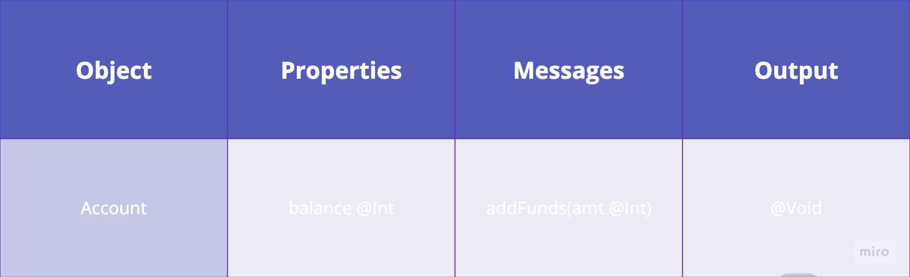
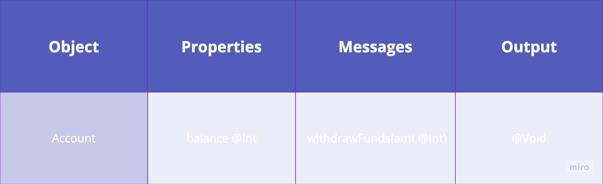
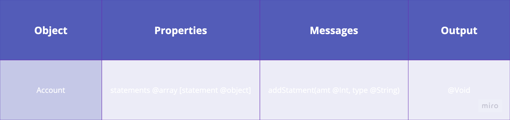
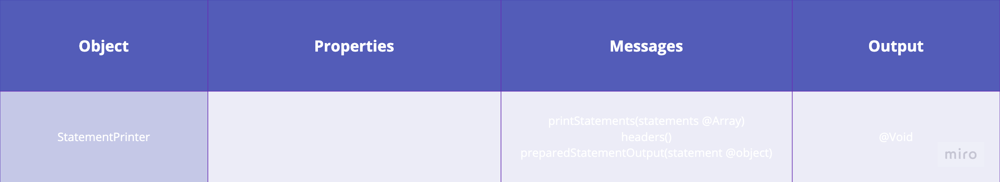
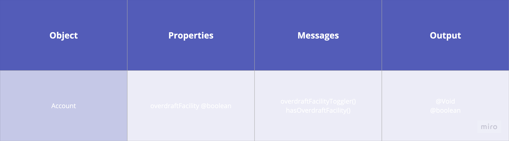

# Domain Models and Test Plan

As a user\
I want to be able to deposit funds to my account \
So that I can add money to my account

As a user\
I want to be able to withdraw funds from my account if I have sufficient funds\
So that I can remove money from my account

As a user\
I want to be able to record my transactions automatically\
So that I check my account history later

As a user\
I want to be able to check my account statements\
So that I see my account balance history

As a user\
I want the statements to be color-coded\
So that I can easily distinguish between credits and debits.

As a user\
I want to be able to enable or disable overdraft facility\
So that I can control whether I can overdraw my account.

As a user\
I want to be able to add an overdraft facility to my account\
So that I can make withdrawals that exceed my current balance up to the limit of the overdraft.

As a user\
I want to be able to configure the amount of my overdraft\
So that I can choose how much I'm able to overdraw.
